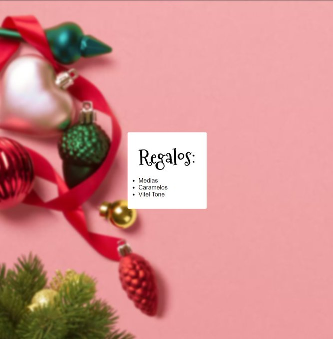

# advenvy

es una proyecto que a lo largo de 24 dias, habra que ir agregando una funcionavilidad difente , con el proposito de poder aprender y pracaticar react junto con JavaScript

## [este proyecto suerge como una idea de goncy (@goncy) en twitter ](https://twitter.com/goncy/status/1466050967808401409)

### desafios diarios

- [x] Día 1: Para calentar motores vamos a mantener las cosas simples, mostremos una lista de regalos, 3 elementos, fijos, sin nada más. Los elementos están hardcodeados? En un estado? Depende de vos
      

- [x] Día 2: Nuestra app se ve muy poco navideña, demosle unos colores más lindos, rojo, verde, amarillo! Podemos ponernos creativos con lo que queramos!
      

- [x] Día 3: Estámos generosos, vamos a agregar un formulario con un input para escribir nuestro regalo y un botón para agregarlo a nuestra lista, todavía no los podemos borrar, pero... es navidad! Por que querríamos borrar regalos?

- [x] Día 4: Papa noel no estuvo muy contento con la demanda de regalos, vamos a tener que agregar un botón de eliminar a cada elemento para poder borrarlos individualmente.
      

- [x] Día 5: La gente está muy indecisa y agrega muchos regalos y después los debe borrar de a uno! Agreguemos un botón para eliminar todos los regalos a la vez!
      

- [x] Día 6: Nuestra aplicación no se ve muy bien cuando no hay regalos, agreguemos un mensaje alentando a agregar regalos cuando no haya ninguno!, " este punto lo he solucionado desde advency02"
      

- [x] Día 7: Tuvimos algunos reportes de regalos vacíos o repetidos, asegurmosnos que la gente solo pueda agregar un regalo si escribió algo y si ese regalo no está ya en la lista!
      

- [x] Día 8: Cometimos un error el día anterior, la gente quiere agregar regalos repetidos para regalarselos a diferentes personas, agreguemos un campo al lado del input de texto para poner la cantidad de unidades del regalo que deberíamos comprar.
      

- [x] Día 9: La gente está triste por que al cerrar la aplicación pierde todos sus regalos 😢. Usemos `localStorage` para guardar los regalos en el dispositivo del usuario y cargarlos cuando vuelve!
      

- [x] Día 10: Las palabras dicen mucho pero las imágenes más! Agreguemos un campo donde podamos pegar un link de imágen para cada regalo y mostremoslo en la lista.
      
- [x] Día 11: Nuestro formulario tiene muchas cosas y molesta a la vista de los usuarios, pasemoslo a un modal / drawer o lo que quieras y pongamos un botón de "Agregar regalo" que lo muestre.
      
      
